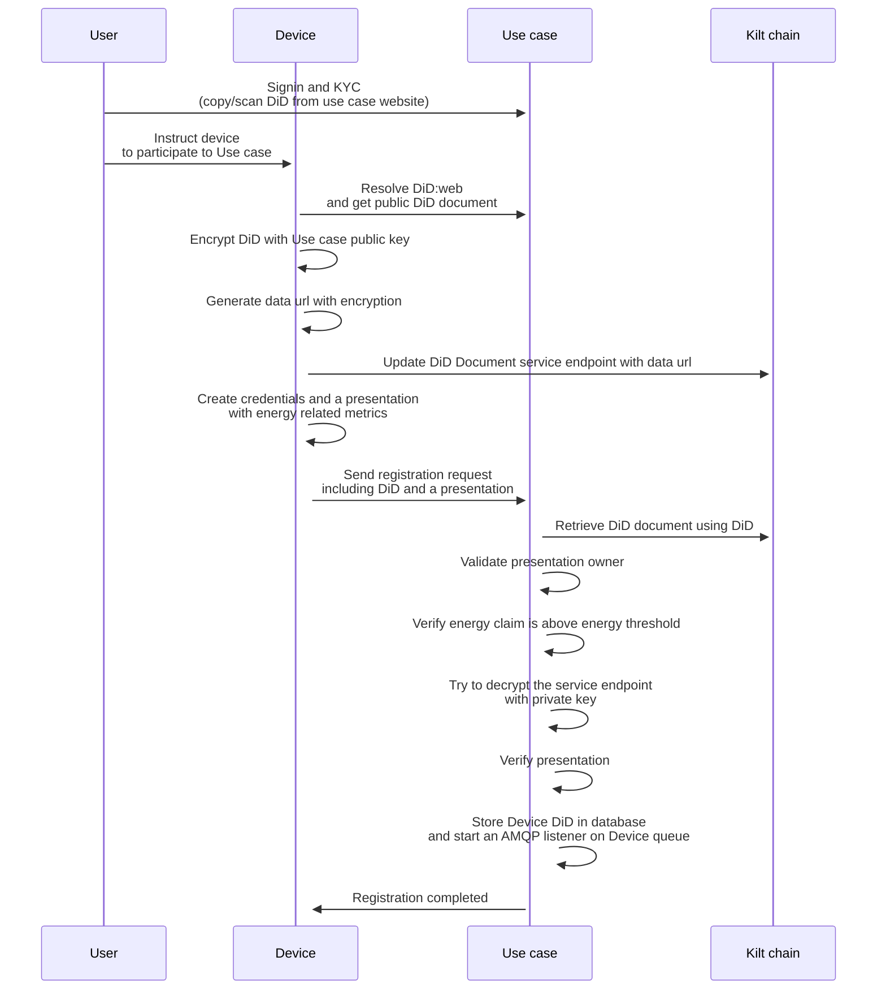

```mermaid
sequenceDiagram
    participant User
    participant Device
    participant Use case
    participant Kilt chain
    User->>+Use case: Signin and KYC <br/>(copy/scan DiD from use case website)
    User->>+Device: Instruct device <br/>to participate to Use case
    Device->>+Use case: Resolve DiD:web <br/>and get public DiD document
    Device->>+Device: Encrypt DiD with Use case public key
    Device->>+Device: Generate data url with encryption
    Device->>+Kilt chain: Update DiD Document service endpoint with data url
    Device->>+Device: Create credentials and a presentation <br/>with energy related metrics
    Device->>+Use case: Send registration request <br/> including DiD and a presentation
    Use case->>+Kilt chain: Retrieve DiD document using DiD
    Use case->>+Use case: Validate presentation owner
    Use case->>+Use case: Verify energy claim is above energy threshold
    Use case->>+Use case: Try to decrypt the service endpoint <br>with private key
    Use case->>+Use case: Verify presentation
    Use case->>+Use case: Store Device DiD in database <br/>and start an AMQP listener on Device queue
    Use case->>+Device: Registration completed
```
